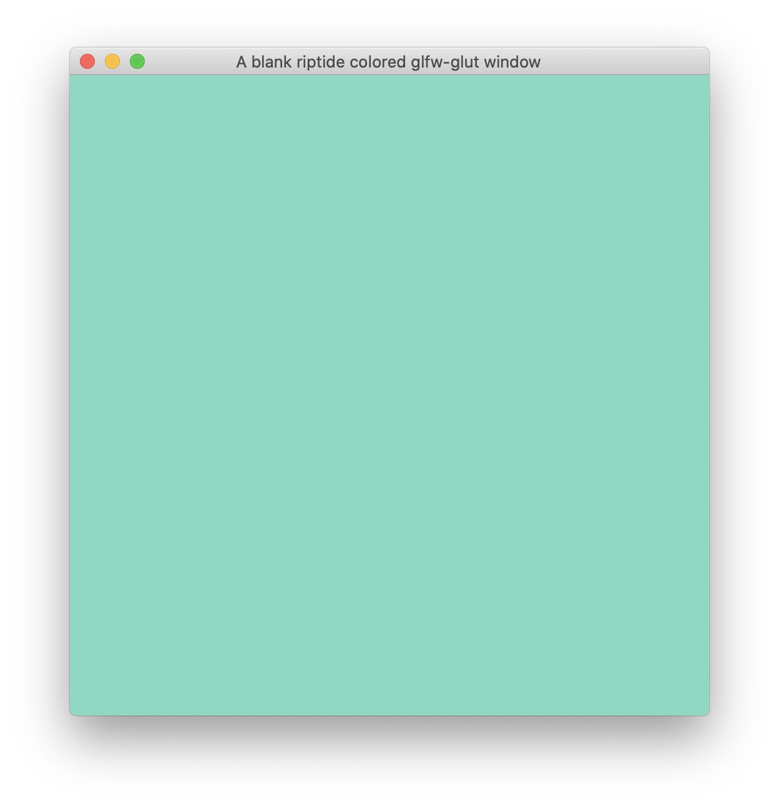

# GLUT reimplemented as a wrapper on GLFW

Get started with 

    git clone --recursive https://github.com/alecjacobson/glfw-glut/

Some old apps use glut and it's a pain to install. This small project attempts
to cover the basic features of glut via corresponding functionality in glfw.

## Compilation of example

    git submodule update --init --recursive
    mkdir build
    cd build
    cmake ../
    make

This should create `./example` which when run produces a blank window like this:

